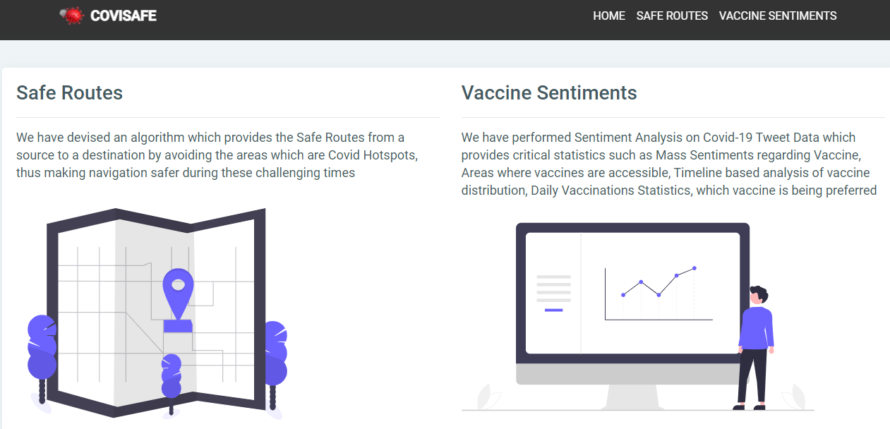
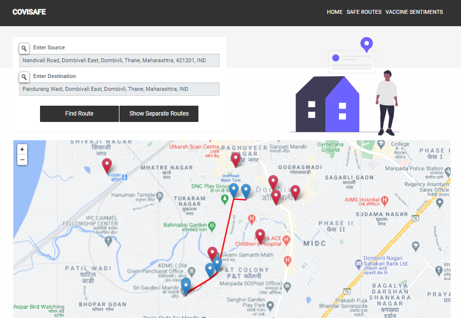
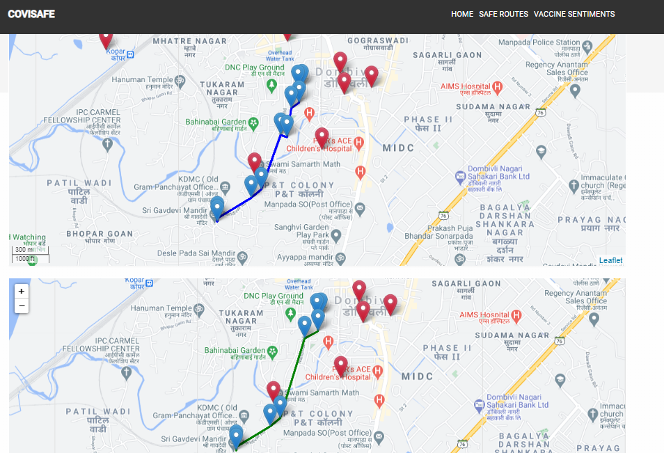
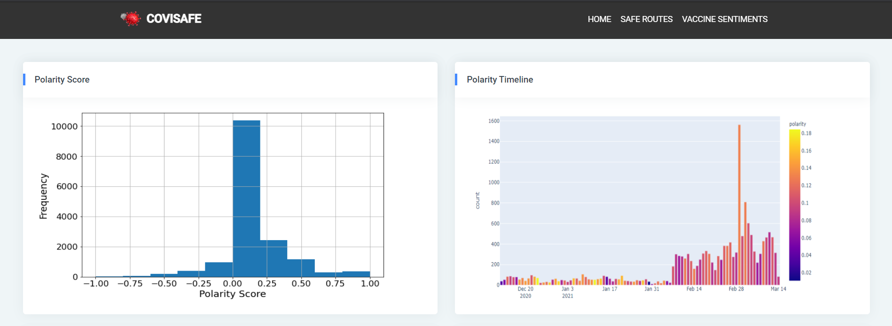
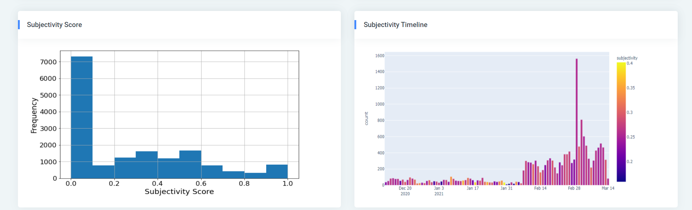
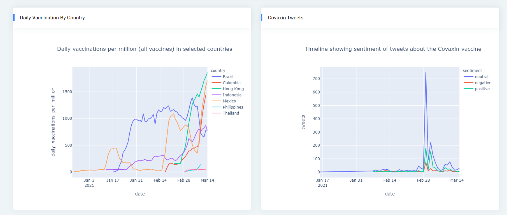

<h1 align="center">CoviSafe</h1>

     

## Introduction:

Given the current Pandemic Situation, with sudden surge in Covid
Cases, there is an utmost need to devise solutions which can contain
the spread of the virus.

Specifically, the issues being addressed are :

1. Safe Commutations through the containment zones
2. Vaccine Sentiments and Analysis

CoviSafe solves the problem through the following supported features:

1. **Safe Routes** - We have devised an algorithm which provides the Safe Routes from a source to a destination by avoiding the areas which are Covid Hotspots.

2. **Vaccine Sentiments** – We have performed Sentiment Analysis on Covid-19 Tweet Data which provides critical statistics such as Mass Sentiments regarding Vaccine, Areas where vaccines are accessible, Timeline based analysis of vaccine distribution, Daily Vaccinations Statistics, which vaccine is being preferred etc.

## Technology Stack:

1. Flask
2. Google Collab
3. Machine Learning
4. NLP
5. HERE Maps
6. LeafletJS Maps
7. GeoIQ Covid-19 Hotspots API

## Why CoviSafe ?

1. While Google Maps provides the routes with least traffic, our algorithm provide routes which are the safest to travel with respect to containment zones.
2. We provide GeoSearch on our application to enter source and destinations.
3. More than one alternative routes for safe travel.
4. Sentiments of the mass regarding vaccine with respect to different geographic zones can help greatly in vaccine distribution process.
5. Our Statistical Analysis shows how views about vaccines are evolving with a proper timeline visualisation.
6. Our analysis can help the government bodies to mitigate the negative views/ sentiments in the highlighted zones of our results.

## Demo:

    </img>
    </img>
    </img>
    </img>
    </img>
    </img>

## Future Improvements:

- [ ] Include Real-Time tweet analysis
- [ ] Analyse the Tweets and detect rumours regarding vaccines and curb them
- [ ] Collect crowdsourced data of Hotspots/ containment zones to provide more precise and safe navigations

## Contributors:

Team Name: whyNot

- [Girish Thatte](https://github.com/girishgr8)
- [Gayatri Srinivasan](https://github.com/gayatri-01)
- [Amisha Waghela](https://github.com/amisha-w)
- [Rahul Mistry](https://github.com/rahulmistry33)

### Made at:

